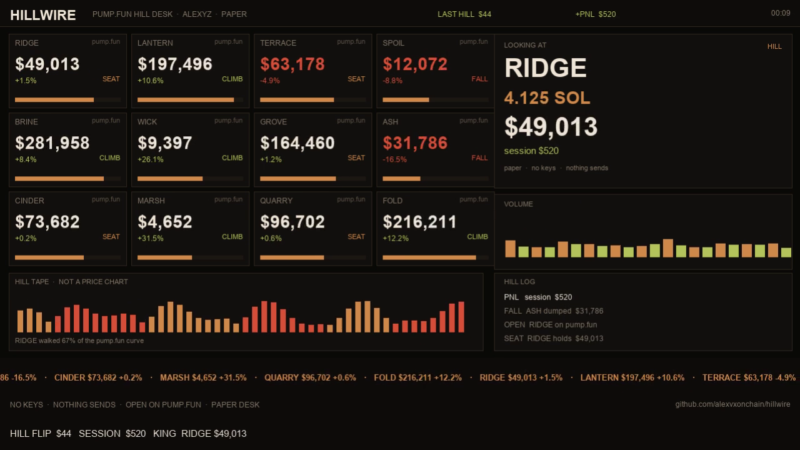

# HILLWIRE

Paper hill desk for [pump.fun](https://pump.fun). Watches the king, not the firehose.

ALEXYZ / session desk. No keys in this repo. Nothing sends.



## What you are looking at

Pump.fun prints a new mint every few seconds. One of them is sitting on **King of the Hill**. That chair moves the board. The rest is noise.

HILLWIRE keeps three reads on that chair:

| read | meaning |
| --- | --- |
| **SEAT** | who holds the hill, and for how long |
| **CLIMB** | who is filling the curve under them |
| **FALL** | the hill changed. the tweet has not |

Default window is **62–91%** of the bonding curve. Below that the hill is still empty noise. Above that you are staring at somebody else's screenshot.

## What it does not do

- It does not copy a wallet
- It does not mint a clone for you
- It does not hold a key
- It does not send a trade

You open the name on pump.fun. You decide.

## Run

```bash
python -m http.server 8787 --bind 127.0.0.1
```

Open http://127.0.0.1:8787

## Layout

```
index.html          1280×720 hill desk
src/tape.js         paper king / climb / fall tape
assets/             stills for the readme
```

## Live later

`.env.example` is a stub. If you ever point this at a real king feed, keep the key off disk and off git. The desk should still be eyes only.
